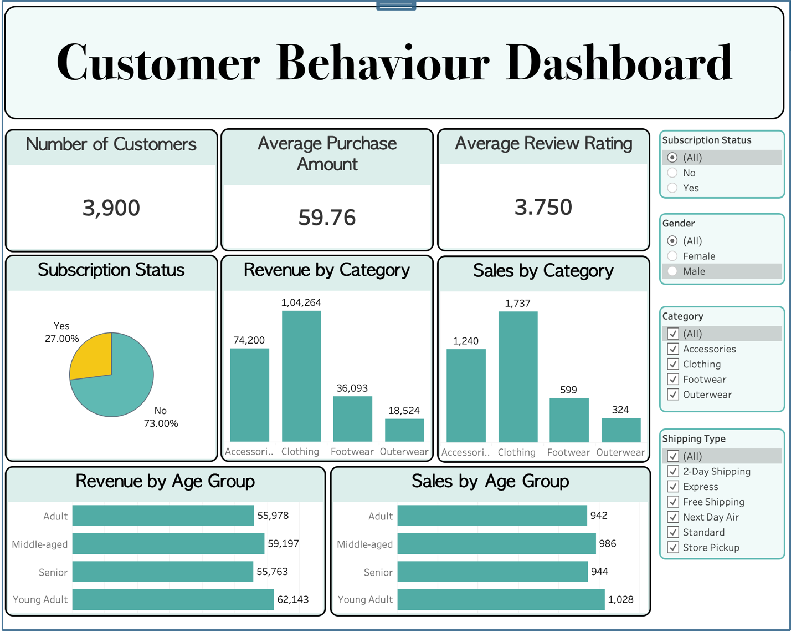

# Customer Shopping Behavior Analysis

An end-to-end data analytics project that takes a raw retail dataset from a CSV file all the way to an interactive, live-connected dashboard and a stakeholder-ready set of insights.

**Stack:** Python (pandas) → PostgreSQL → Tableau



---

## Overview

A leading retail company wants to better understand its customers' shopping behavior in order to improve sales, customer engagement, and long-term loyalty. This project analyzes a dataset of **3,900 customers** to answer one overarching question:

> **How can the company use its customer shopping data to identify trends, improve engagement, and optimize its marketing and product strategy?**

The workflow mirrors what a data analyst does inside a real company: define the business problem → clean and engineer the data in Python → answer targeted business questions in SQL against a relational database → communicate the results through an interactive dashboard, a written report, and a presentation.

---

## Dataset

`data/raw/customer_shopping_behavior.csv` — 3,900 rows × 18 columns. Each row is one customer's most recent purchase.

| Group | Fields |
|---|---|
| Demographics | Customer ID, Age, Gender, Location |
| Purchase details | Item Purchased, Category, Purchase Amount, Size, Color, Season |
| Engagement | Review Rating, Subscription Status, Discount Applied |
| Fulfillment | Shipping Type, Payment Method |
| Loyalty proxies | Previous Purchases (count), Frequency of Purchases |

---

## Tools & Workflow

| Stage | Tools |
|---|---|
| Data cleaning & feature engineering | Python (pandas), Jupyter Notebook |
| Database & business-question analysis | PostgreSQL, pgAdmin |
| Python ↔ database bridge | SQLAlchemy, psycopg2 |
| Dashboard & visualization | Tableau (live database connection) |
| Reporting | Word report, presentation deck |

---

## Project Structure

```
customer-shopping-behavior-analysis/
├── data/
│   ├── raw/            # original dataset
│   └── processed/      # cleaned dataset exported from the notebook
├── notebooks/          # 01_data_cleaning_eda.ipynb — cleaning + feature engineering
├── sql/                # customer_behavior_analysis.sql — 10 business-question queries
├── assets/             # dashboard screenshot
├── reports/            # full project report (with screenshots)
├── presentation/       # slide deck (.pptx and .pdf)
└── README.md
```

---

## Methodology

**1 · Data cleaning & feature engineering (Python)**
- Imputed 37 missing review ratings using the **median rating within each product category** (robust to outliers and fairer than a single global median).
- Standardized all column names to `snake_case`.
- Engineered `age_group` (quartile-based bins: Young Adult / Adult / Middle-aged / Senior) and `purchase_frequency_days` (converted textual frequency to a numeric day-count).
- Detected and dropped `promo_code_used` — it was 100% identical to `discount_applied`.

**2 · Business-question analysis (SQL)**
- Loaded the cleaned data into PostgreSQL via SQLAlchemy and answered 10 business questions using aggregates, `GROUP BY` segmentation, subqueries, `CASE WHEN`, CTEs, and window functions (`ROW_NUMBER`). See [`sql/customer_behavior_analysis.sql`](sql/customer_behavior_analysis.sql).

**3 · Dashboard (Tableau)**
- Connected Tableau directly to the PostgreSQL database (live connection) and built KPI cards, category & age-group breakdowns, and cross-filters for Subscription Status, Gender, Category, and Shipping Type.

---

## Key Findings

**Headline KPIs**

| Metric | Value |
|---|---|
| Total customers | 3,900 |
| Average purchase amount | $59.76 |
| Average review rating | 3.75 / 5 |
| Subscribed | 27% (1,053) · **73% not subscribed (2,847)** |

**Revenue by category** — Clothing is the core of the business (~45% of revenue and orders):

| Category | Revenue | Orders |
|---|---|---|
| Clothing | $104,264 | 1,737 |
| Accessories | $74,200 | 1,240 |
| Footwear | $36,093 | 599 |
| Outerwear | $18,524 | 324 |

**Other insights**
- **Revenue is spread evenly across age groups** (Young Adult $62,143 · Middle-aged $59,197 · Adult $55,978 · Senior $55,763) — no single generation dominates.
- **Gender:** Male $157,890 (68%) vs Female $75,191 (32%). The male lead is driven by customer *count* — women actually spend marginally more per head.
- **Loyalty:** 80% of customers are loyal repeat buyers, yet only ~27% subscribe — and subscription does **not** lift spend. Converting loyal non-subscribers is the biggest opportunity.
- **Products:** highest-rated items are Gloves (3.86), Sandals (3.84) and Boots (3.82); the most discount-reliant are Hat (50%), Coat (49%) and Sneakers (49%).

---

## Business Recommendations

1. **Grow subscriptions** — 73% aren't subscribed and subscription doesn't lift spend; redesign the offer with real added value.
2. **Convert loyal non-subscribers** — target repeat buyers (80% of the base) who don't subscribe.
3. **Acquire more female customers** — they're 32% of the base but spend slightly more per order.
4. **Audit discount-reliant products** — review margins on items that only sell with heavy discounts.
5. **Reinforce Clothing** as the flagship category while investigating Outerwear's low share.
6. **Feature top-rated & best-selling products** in marketing; consider premium pricing for consistent top performers.
7. **Invest in faster delivery** — express-shipping customers spend modestly more.

---

## How to Reproduce

```bash
# 1. Create and activate a virtual environment
python3 -m venv .venv
source .venv/bin/activate            # Windows: .venv\Scripts\activate

# 2. Install dependencies
pip install pandas numpy notebook sqlalchemy psycopg2-binary matplotlib seaborn

# 3. Run the notebook to clean the data and load it into PostgreSQL
jupyter notebook notebooks/01_data_cleaning_eda.ipynb

# 4. Run the SQL analysis in pgAdmin (or psql) against the customer_behavior database
#    sql/customer_behavior_analysis.sql
```

---

## Author

**Manas Jaiswal** — data analytics portfolio project.
